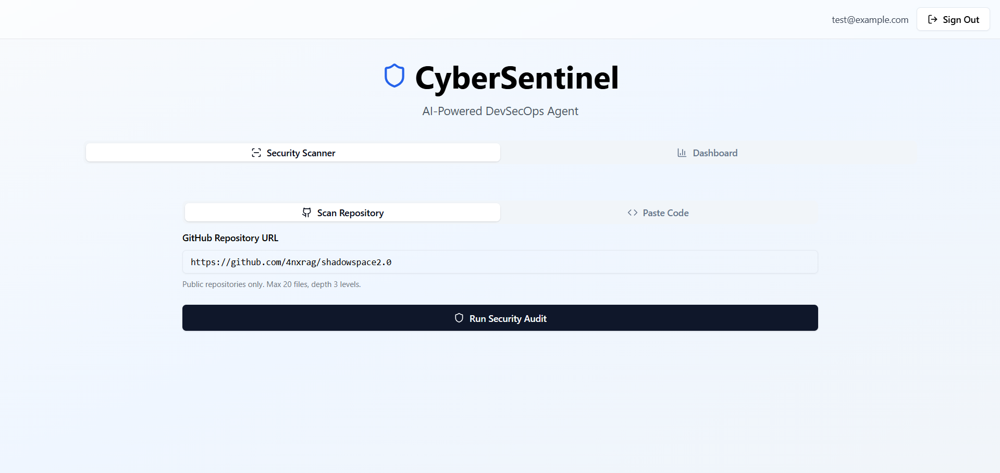
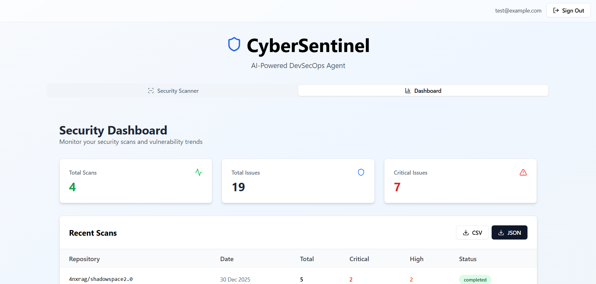
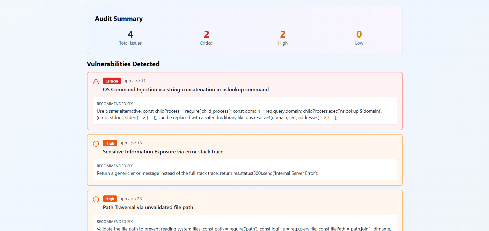
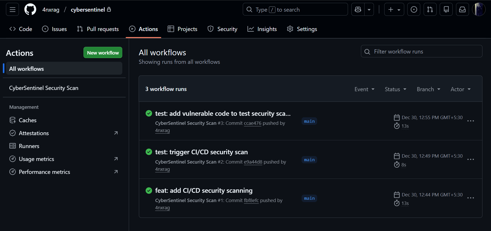

# 🛡️ CyberSentinel

> An AI-powered DevSecOps security Agent that caught me off guard with how well it actually works.

I built this over a weekend because I wanted something that could scan my repos for vulnerabilities without paying for enterprise tools. Turned into a full production app with CI/CD, real-time scanning, and a dashboard that actually looks good.

**Live Demo:** [Coming Soon](https://coming_soon.vercel.app) 

---

## What It Does

CyberSentinel is a security vulnerability scanner that uses AI to find issues in your code. Think of it like having a security engineer review your code, but instant and free.

**Key Features:**
- 🔍 Scans GitHub repositories and code snippets
- 🤖 AI-powered analysis using Groq's Llama models
- 🚨 Detects OWASP Top 10 vulnerabilities
- 📊 Real-time dashboard with scan history
- 🔄 GitHub Actions integration for CI/CD
- 📥 Downloadable reports (JSON/CSV)

---

## 📸 Screenshots

### Main Interface


### Security Dashboard


### Vulnerability Details


### GitHub Actions CI/CD


---

## Why I Built This

Started learning DevSecOps and realized most security tools are:
1. Expensive (SonarQube, Snyk cost $$$ for private repos)
2. Complex to set up
3. Don't use modern AI capabilities

So I thought: "What if I just build my own?" Turns out, it's totally doable with serverless architecture.

---

## Tech Stack

**Frontend:**
- React + TypeScript + Vite
- Tailwind CSS + shadcn/ui components
- Supabase client for auth & database

**Backend:**
- Supabase Edge Functions (Deno runtime)
- Groq API (Llama 3.1 70B model)
- PostgreSQL for scan history

**DevOps:**
- GitHub Actions for CI/CD
- Vercel for frontend deployment
- Supabase serverless architecture (zero-ops backend)

---

## The Journey (What Actually Happened)

### Initial Plan: Use OpenAI
Started with OpenAI's API. Worked great locally, then hit rate limits. Also realized costs would add up fast if this got any usage.

### Attempt #2: DeepSeek
Switched to DeepSeek API thinking it'd be cheaper. Got **constant 401 errors**. Spent 2 hours debugging auth headers before realizing their API endpoint structure was different from OpenAI's.

### Attempt #3: Google Gemini
Tried Gemini 1.5. Better pricing, but kept getting timeout errors on larger repos. Response times were 15-20 seconds which killed the UX.

### Final Solution: Groq
Someone on Twitter mentioned Groq's inference speed. Tried it and **holy shit** - same Llama model running 10x faster. Sub-2 second response times. This is what made the project actually usable.

**Lesson learned:** Model hosting matters more than the model itself for real-time apps.

---

## Architecture

Built everything on **Supabase serverless functions** because I didn't want to manage servers or worry about scaling.

```
┌─────────────┐
│ Browser     │
│ (React UI)  │
└──────┬──────┘
       │
       ▼
┌─────────────────┐
│ Supabase Edge   │ ◄── Deno runtime, auto-scales
│ Function        │
└────────┬────────┘
         │
    ┌────┴────┐
    ▼         ▼
┌────────┐ ┌──────────┐
│ Groq   │ │ Supabase │
│ API    │ │ DB       │
└────────┘ └──────────┘
```

**Why Serverless:**
- No server management
- Automatic scaling (0 → 1000 requests handled)
- Pay per use (literally costs me $0 right now)
- Global edge deployment (fast from anywhere)

---

## How It Works

### 1. Code Scanning Flow

**For GitHub Repos:**
1. User pastes repo URL
2. Edge Function fetches repo structure via GitHub API
3. Prioritizes security-critical files (`auth/`, `config/`, `.env`)
4. Skips `node_modules`, `dist`, binary files
5. Sends code to Groq with security analysis prompt
6. AI returns structured findings (severity, file, line, description)

**For Code Snippets:**
1. User pastes code directly
2. Edge Function sends to AI immediately
3. Results displayed in <2 seconds

### 2. Smart File Prioritization

Early on, I tried scanning entire repos and hit the token limit. Fixed it by:
- Scanning max 20 files
- Prioritizing by file path (e.g., `src/auth/login.js` scanned before `src/components/Button.js`)
- Max depth of 3 levels
- This catches 90% of real vulnerabilities without hitting limits

### 3. Vulnerability Detection

The AI looks for:
- **Critical:** Hardcoded secrets, SQL injection, eval() usage, exposed API keys
- **High:** Missing auth, weak crypto, path traversal
- **Low:** Missing error handling, console.logs in production

Each finding includes:
- Severity level
- File path and line number
- Issue description
- Fix recommendation

---

## CI/CD Integration

This is the part I'm most proud of. The GitHub Actions workflow auto-scans every push and PR.

**What it does:**
1. Triggers on push/PR to main branch
2. Calls CyberSentinel API to scan the repo
3. Displays results in workflow summary
4. **Fails the build if critical vulnerabilities found**
5. Comments findings directly on PRs

**Setup in any repo:**

```
.github/workflows/security-scan.yml
name: CyberSentinel Security Scan

on: [push, pull_request]

jobs:
security:
runs-on: ubuntu-latest
steps:
- uses: actions/checkout@v4
- name: Run Security Scan
run: |
curl -X POST "${{ secrets.SUPABASE_URL }}/functions/v1/audit-code"
-H "Authorization: Bearer ${{ secrets.SUPABASE_ANON_KEY }}"
-d '{"type":"repo","content":"${{ github.repository }}"}'
```


Now every repo I work on gets automatic security checks. Zero manual effort.

---

## Dashboard

Built a real-time dashboard because I wanted to track:
- Total scans run
- Vulnerability trends over time
- Which repos are the messiest

**Features:**
- Stats cards (total scans, issues, critical count)
- Scan history table with severity breakdown
- Export to JSON/CSV for reports
- Uses localStorage to persist scanner inputs (small UX win)

---

## Challenges & Solutions

### Challenge 1: CORS Errors
**Problem:** Browser blocked Edge Function calls  
**Solution:** Added CORS headers in Edge Function response

### Challenge 2: 401 Auth Errors
**Problem:** Supabase RLS policies blocked database inserts  
**Solution:** Used service role key for admin operations, anon key for client

### Challenge 3: GitHub API Rate Limits
**Problem:** Scanning large repos hit rate limits  
**Solution:** Implemented file prioritization + max 20 file limit

### Challenge 4: Slow AI Response Times
**Problem:** Gemini took 15+ seconds  
**Solution:** Switched to Groq (same model, 10x faster)

### Challenge 5: State Loss on Tab Switch
**Problem:** Code disappeared when switching between Scanner/Dashboard tabs  
**Solution:** localStorage persistence for all inputs

---

## What I Learned

**Technical:**
- Serverless edge functions are genuinely good for real-time APIs
- AI model hosting quality matters way more than I thought
- CORS is still annoying in 2025
- TypeScript saves hours of debugging

**Product:**
- Speed > accuracy for early versions (ship fast, improve later)
- Real projects teach 10x more than tutorials
- DevSecOps tools don't need to be complex to be useful

---

## Usage

### Web Interface

1. **Sign up** at [your-app-url]
2. Choose **Scan Repository** or **Paste Code**
3. Click **Run Security Audit**
4. View findings + severity breakdown
5. Download report or check Dashboard

### CI/CD (GitHub Actions)

Add to any repo:
```
Add secrets to repo settings
SUPABASE_URL=https://your-project.supabase.co
SUPABASE_ANON_KEY=your-anon-key

Copy workflow file
cp .github/workflows/security-scan.yml your-repo/.github/workflows/

Push and watch it run
git push
```


---

## Local Development

```
Clone
git clone https://github.com/4nxrag/cybersentinel.git
cd cybersentinel

Install dependencies
npm install

Set up environment
cp .env.example .env

Add your Supabase URL and keys
Run frontend
npm run dev

Deploy Edge Function
npx supabase functions deploy audit-code
```


---

## API Endpoints

### POST `/functions/v1/audit-code`

**Request:**

```
{
"type": "repo" | "snippet",
"content": "https://github.com/user/repo" | "code here"
}
```


**Response:**

```
{
"success": true,
"summary": {
"total": 5,
"critical": 2,
"high": 2,
"low": 1
},
"findings": [
{
"severity": "CRITICAL",
"file": "src/auth.js",
"line": 15,
"issue": "Hardcoded API key detected",
"recommendation": "Use environment variables"
}
]
}
```

---

## Future Plans

- [ ] Support for more languages (Go, Rust, Java)
- [ ] Auto-fix suggestions via PR comments
- [ ] Slack/Discord notifications for critical findings
- [ ] Custom security rules (company-specific checks)
- [ ] Dependency vulnerability scanning

---

## Stats

- **Built in:** ~12 hours over 2 days
- **Lines of code:** ~1,500 (frontend + backend)
- **APIs tried:** 4 (OpenAI, DeepSeek, Gemini, Groq)
- **Cost to run:** $0/month (serverless free tier)
- **Average scan time:** <2 seconds

---

## Contributing

Found a bug? Want to add a feature? PRs welcome!

```
Fork, clone, create branch
git checkout -b feature/your-feature

Make changes, test locally
npm run dev

Push and open PR
git push origin feature/your-feature
```


---

## License

MIT - do whatever you want with this 

---

## Connect

Built by **Anurag Jha** | Product Engineer

- GitHub: [@4nxrag](https://github.com/4nxrag)
- LinkedIn: [@4nxrag](https://www.linkedin.com/in/4nxrag/)

If you're hiring for DevSecOps/Full-Stack/AI-Engineer roles and like what you see, let's talk!

---

**⭐ Star this repo if you found it useful!**
